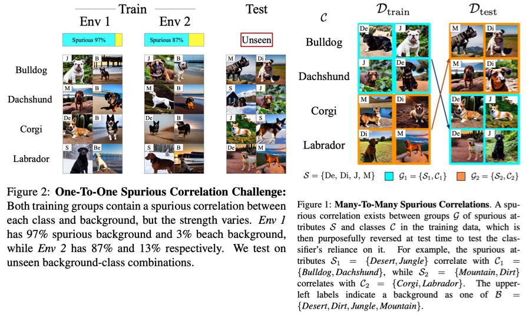

# Spawrious



Spawrious is a challenging OOD image classification benchmark ([link to paper](https://arxiv.org/abs/2303.05470)). It consists of 6 separate OOD challenges split into two types: one-to-one and many-to-many spurious correlation challenges.

The dataset contains images of 4 dog breeds, found in 6 locations. The entire dataset consists of ~152,000 images, but each challenge only requires a subset of this. As a result, the repo allows users to only download the mimimal dataset required for a given spawrious challenge. 

## Example script

Datasets take the following names: 
- `entire_dataset` 
- `o2o_easy`
- `o2o_medium`
- `o2o_hard`
- `m2m` 
 
Running the command below retrieves the appropriate dataset at a user specified user directory (and downloads the dataset if not available), trains a [resnet18](https://pytorch.org/hub/pytorch_vision_resnet/), and evaluates the results on the OOD test set.

```
python example.py --data_dir <path to data dir> --dataset <one of the list above>
```

## Downloading the datasets

### Formatting

The datasets overlap in images, but are offered separately anyway. In order to avoid image duplicates, create a text file `datasets.txt` in the data directory (`path to data dir`), with the name of the dataset that has been downloaded. For example, if both one-to-one easy and one-to-one hard have been downloaded, the data directory will look like

```
data
│   datasets.txt
└───spawrious224
```
where the `datasets.txt` file looks like

```
o2o_easy
o2o_hard
```

### Click to download the datasets:
- [entire_dataset](https://www.dropbox.com/s/e40j553480h3f3s/spawrious224.tar.gz?dl=1)
- [one-to-one easy](https://www.dropbox.com/s/kwhiv60ihxe3owy/spawrious__o2o_easy.tar.gz?dl=1)
- [one-to-one medium](https://www.dropbox.com/s/x03gkhdwar5kht4/spawrious224__o2o_medium.tar.gz?dl=1)
- [one-to-one hard](https://www.dropbox.com/s/p1ry121m2gjj158/spawrious__o2o_hard.tar.gz?dl=1)
- [many-to-many (all)](https://www.dropbox.com/s/5usem63nfub266y/spawrious__m2m.tar.gz?dl=1)

## Licensing

This project is licensed under the terms of the MIT license.
