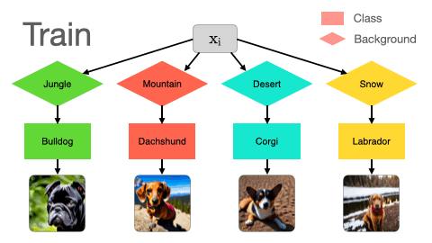
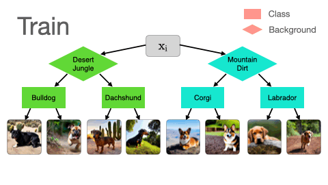

# Spawrious

## One-to-one Spurious Correlations


## Many-to-many Spurious Correlations


Spawrious is a challenging OOD image classification benchmark ([link to paper](https://arxiv.org/abs/2303.05470)). It consists of 6 separate OOD challenges split into two types: one-to-one and many-to-many spurious correlation challenges.

The dataset contains images of 4 dog breeds, found in 6 locations. The entire dataset consists of ~152,000 images, but each challenge only requires a subset of this. As a result, the repo allows users to only download the mimimal dataset required for a given spawrious challenge. 

## Example script

Datasets take the following names: 
- `entire_dataset` 
- `o2o_easy`
- `o2o_medium`
- `o2o_hard`
- `m2m_easy`
- `m2m_medium`
- `m2m_hard` 
 
Running the command below retrieves the appropriate dataset at a user specified user directory (and downloads the dataset if not available), trains a [resnet18](https://pytorch.org/hub/pytorch_vision_resnet/), and evaluates the results on the OOD test set.

```
python example.py --data_dir <path to data dir> --dataset <one of the list above>
```

## Installation
```
pip install git+https://github.com/aengusl/spawrious.git
```


## Using the datasets
```python
from spawrious.torch import get_spawrious_dataset
# spawrious.tf if using tensorflow or jax

dataset = "m2m_medium"
data_dir = ".data/"
val_split = 0.2

device = torch.device("cuda:0" if torch.cuda.is_available() else "cpu")
spawrious = get_spawrious_dataset(dataset_name=dataset, root_dir=data_dir)
train_set = spawrious.get_train_dataset()
test_set = spawrious.get_test_dataset()
val_size = int(len(train_set) * val_split)
train_set, val_set = torch.utils.data.random_split(
    train_set, [len(train_set) - val_size, val_size]
)
```

### Click to download the datasets:
- [entire_dataset](https://www.dropbox.com/s/e40j553480h3f3s/spawrious224.tar.gz?dl=1)
- [one-to-one easy](https://www.dropbox.com/s/kwhiv60ihxe3owy/spawrious__o2o_easy.tar.gz?dl=1)
- [one-to-one medium](https://www.dropbox.com/s/x03gkhdwar5kht4/spawrious224__o2o_medium.tar.gz?dl=1)
- [one-to-one hard](https://www.dropbox.com/s/p1ry121m2gjj158/spawrious__o2o_hard.tar.gz?dl=1)
- [many-to-many (all)](https://www.dropbox.com/s/5usem63nfub266y/spawrious__m2m.tar.gz?dl=1)

## Licensing

Shield: [![CC BY 4.0][cc-by-shield]][cc-by]

This work is licensed under a
[Creative Commons Attribution 4.0 International License][cc-by].

[![CC BY 4.0][cc-by-image]][cc-by]

[cc-by]: http://creativecommons.org/licenses/by/4.0/
[cc-by-image]: https://i.creativecommons.org/l/by/4.0/88x31.png
[cc-by-shield]: https://img.shields.io/badge/License-CC%20BY%204.0-lightgrey.svg
